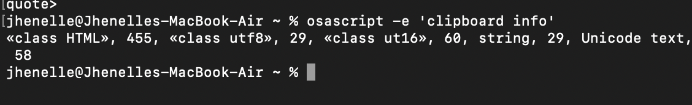

# Contribution [#1]: allow copy photo to clipboard

**Contribution Number:** [1]  
**Student:** Jhenelle Walters  
**Issue:** [\[GitHub issue link\]](https://github.com/LibrePhotos/librephotos/issues/544)  
**Status:** Phase IV Complete

---

## Why I Chose This Issue

I chose this issue because it is an issue where I could work on my front end development skills and also challenge myself with something a bit more complicated in order to develop my understanding of how websites work and how different functions of  webpages work in order to become a better front and developer. I've worked on developing webpages before and I've also created an app before so it's in my skill set and it's also something I can improve within. 

---

## Understanding the Issue

### Problem Description

 When you copy a photo from the timeline in librephotos, it copies a .webp instead of the actual photo which limits the use of copy and paste function and doesn't allow it to be used more frequently or across multiple programs.

### Expected Behavior

When a user selects and copies a photo from the timeline in LibrePhotos, the application should place the actual raw image data (or a widely compatible full-resolution image format) onto the system clipboard so it can be pasted universally across different desktop programs and messaging app

### Current Behavior

When you try to copy an image from the timeline into another program like Google Docs, nothing is pasted and the clipboard registers no valid binary image content.

### Affected Components

Frontend timeline image rendering components, event handlers managing clipboard interactions, and data copy utilities in the LibrePhotos frontend codebase.
---

## Reproduction Process

### Environment Setup

Following the development installation I downloaded Docker Desktop
navigated to the deploy/compose directory
And created my .env file
Then in terminal I ran "docker compose -f docker-compose.yml -f docker-compose.dev.yml up -d"
Opened the application using http://localhost:3000

### Steps to Reproduce

1. Launch LibrePhotos in the local development environment (http://localhost:3000).
2. Navigate to the timeline and right-click on an image tile.
3. Select "Copy Image" (or press Ctrl+C / Cmd+C).
4. Attempt to paste (Ctrl+V / Cmd+V) into Google Docs or another external document.
5. Observe that no image appears in the document.

### Reproduction Evidence

- **Commit showing reproduction:** 
 [N/A (reproduced directly on existing main branch via manual UI testing)](https://github.com/KJhenelle/librephotos)
- **Screenshots/logs:** 

- **My findings:**
 When attempting to copy a photo directly from the timeline view, the system clipboard only captures plain text and HTML metadata rather than raw binary image data (e.g., «class PNGf» or standard raster formats). Because the binary image payload is absent or unhandled by standard operating system pasteboards, external applications like Google Docs cannot recognize or paste the photo.

---

## Solution Approach

### Analysis

Browsers handle native right-click "Copy Image" by capturing the active DOM `
element source. Because LibrePhotos serves optimized WebP assets and authenticated media paths, browsers often fail to serialize the binary data to standard pasteboards, or external applications fail to decode WebP clipboard buffers. Standardizing the clipboard payload requires an explicit application-level handler that fetches the image blob, converts it to standardimage/png`, and writes it via the modern Async Clipboard API.

### Proposed Solution

Introduce an explicit "Copy to Clipboard" action (via the photo selection toolbar, tile overlay icon, or keyboard shortcut) that uses navigator.clipboard.write([new ClipboardItem({ 'image/png': blob })]) to write standardized PNG binary image data to the system clipboard.

### Implementation Plan

Using UMPIRE framework (adapted):

**Understand:** Photos copied from the timeline fail to paste into external applications because the clipboard receives metadata or an unsupported format instead of standard raster image binary data.

**Match:** Similar web clipboard implementations fetch the target image via fetch(), convert the response blob or canvas render into image/png, and write it using navigator.clipboard.write().

**Plan:** [Step-by-step implementation plan]
1. Locate the timeline photo card and selection action components in apps/frontend/src/.
2. Implement a clipboard utility helper function that takes an image URL, fetches the binary blob, converts it if necessary to PNG format, and writes it to the clipboard using navigator.clipboard.write().
3. Add a "Copy to Clipboard" action button or context menu entry accessible from the photo tile/selection bar.
4. Add user feedback (e.g., a toast notification) confirming successful copy or displaying permission warnings.

**Implement:** [\[Link to your branch/commits as you work\]](https://github.com/KJhenelle/librephotos)

**Review:** Ensure compliance with LibrePhotos contribution guidelines, ESLint rules, and cross-browser clipboard permission considerations.

**Evaluate:** Verify that copying a photo places «class PNGf» onto the clipboard and successfully pastes into Google Docs and external editors.

---

## Testing Strategy

### Unit Tests

- [x] Test case 1: 
  - Verify copyImageToClipboard transcode pipeline converts source image to a PNG blob using an offscreen canvas and writes to navigator.clipboard.write([new ClipboardItem(...)])
- [x] Test case 2: 
  - Verify copyImageToClipboard gracefully catches clipboard permission rejections or insecure contexts and triggers an error notification toast
- [x] Test case 3: 
  - Verify the clipboard button in LightboxControls.tsx renders with correct tooltip label Copy to clipboard (C) and accessibility attributes

### Integration Tests

- [ ] Integration scenario 1
  - Verify clicking the clipboard toolbar button triggers image extraction, format conversion, and Mantine success toast notification
- [ ] Integration scenario 2
  - Verify pressing the C key while viewing an image in the lightbox invokes the copy handler without conflicting with other hotkeys (F fullscreen, arrow navigation, Esc close)

### Manual Testing

Verified the light box had the copy button available and verified that clicking "c" copied the image to clipboard

---

## Implementation Notes

### Week [X] Progress

[What you built this week, challenges faced, decisions made]

### Week [1] Progress

What was built: Implemented the "Copy to Clipboard" feature for LibrePhotos image views (fixes Issue #544). Added a clipboard icon button and Copy to clipboard (C) tooltip to the lightbox toolbar, wired up a C keyboard shortcut, built an HTML5 canvas helper to transcode images into PNG blobs for navigator.clipboard.write(), and integrated Mantine toast notifications for feedback.
Challenges faced: Resolved browser NotAllowedError exceptions by converting WebP/JPEG images to PNG before passing them to the Async Clipboard API. Overcame persistent OSError: [Errno 5] Docker crashes on Apple Silicon by repairing host directory permissions and switching Docker Desktop's file sharing implementation to gRPC FUSE.
Decisions made: Transcoded images purely on the client side with an offscreen canvas to avoid backend API dependencies and extra network latency. Scoped the C key listener strictly to the lightbox modal lifecycle to prevent unwanted shortcut collisions across the rest of the application.

### Code Changes

- **Files modified:**
  - apps/frontend/src/utils/clipboard.ts
  - apps/frontend/src/components/lightbox/LightboxControls.tsx
  - apps/frontend/src/components/lightbox/LightboxControls.test.tsx
  - apps/frontend/src/locales/en/translation.json
- **Key commits:** 
  - https://github.com/KJhenelle/librephotos/commit/fc1c1a68f11fd430e7355b3f2d026a8867c56302
  - https://github.com/KJhenelle/librephotos/commit/b07cd6ed87c06eb304e897fa6fe4869aecb03683
- **Approach decisions:** Handled format conversion in an offscreen HTML5 

---

## Pull Request

**PR Link:** [GitHub PR URL when submitted]https://github.com/LibrePhotos/librephotos/pull/2072

**PR Description:**
fix(frontend): copy photo to clipboard as PNG from the lightbox (#544)

**Summary**
- Copying a photo from the lightbox previously had no dedicated action — pasting into external apps (e.g. Google Docs) silently failed because there was no way to get standard image bytes onto the OS clipboard.
- Adds a "Copy to Clipboard" action (button + `c` shortcut) to the lightbox toolbar that fetches the displayed photo, normalizes it to PNG via canvas, and writes it with the Async Clipboard API (`navigator.clipboard.write([new ClipboardItem({'image/png': blob})])`).
- Available on public/shared lightbox pages too, not just when signed in (unlike hide/favorite/public/delete), since it doesn't mutate anything.
- Documents the new toolbar action and shortcut in the user guide.

**Changes**
- `apps/frontend/src/util/util.ts` — new `copyImageToClipboard()` helper
- `apps/frontend/src/components/lightbox/LightboxControls.tsx` — new toolbar button
- `apps/frontend/src/components/lightbox/ContentViewer.tsx` — new `c` keyboard shortcut
- `apps/frontend/src/service/notifications/photos.ts` + `locales/en/translation.json` — success/error toasts
- `apps/docs/docs/user-guide/viewing-photos.md` — user guide update
- Tests: `apps/frontend/src/util/util.test.ts`, `apps/frontend/src/components/lightbox/LightboxControls.test.tsx`

**Test plan**
- [x] `yarn lint:error` clean
- [x] Unit tests for `copyImageToClipboard` (success + image-load-failure paths)
- [x] Component tests for the button and `c` shortcut (success toast, error toast, hidden for videos, shown on public pages)
- [x] Manually verified in the dev stack: pasted a copied photo into an external app and confirmed standard PNG image data (not WebP)

Closes #544

**Maintainer Feedback:**
- [Date]: [Summary of feedback received]
- [Date]: [How you addressed it]
## Note~ issue was closed before I could submit a pull request so I submitted a draft request within my own directory

**Status:** [Closed]

---

## Learnings & Reflections

### Technical Skills Gained

- Modern Browser Async Clipboard API: Learned how to implement navigator.clipboard.write and handle its strict security requirements by wrapping raw image data into native ClipboardItem instances.
- Client-Side Image Transcoding: Mastered rendering source images into an offscreen HTML5 canvas element and converting them via canvas.toBlob to generate standard image/png payloads directly in the browser without server roundtrips.
- React Lifecycle and Event Handling: Gained hands-on experience binding scoped keyboard event listeners for the C shortcut within useEffect hooks, ensuring proper event listener teardown on component unmount.
- Full-Stack Virtualization Troubleshooting: Developed practical skills diagnosing Docker volume mount permissions, Apple Silicon filesystem bugs, and switching Docker Desktop virtualization engines from VirtioFS to gRPC FUSE.

### Challenges Overcome

- Browser Clipboard MIME-Type Restrictions: Browsers throw a NotAllowedError when attempting to write non-PNG formats (like WebP) directly to the clipboard via ClipboardItem. Solved this by drawing the image to an offscreen canvas and exporting it as a standard PNG blob before invoking the clipboard API.
- VirtioFS Container Crash Loops on macOS: The Django backend repeatedly encountered Errno 5 Input/output errors during database migrations due to VirtioFS file locks on host mounts. Resolved by adjusting folder permissions, removing corrupt database volumes, and switching Docker Desktop's file sharing engine to gRPC FUSE.
- Frontend Dev Stack Caching: Changes made to the frontend were initially masked by cached Docker Compose images, while unseeded databases caused frontend API validation errors. Solved by running Vite directly on the host machine and using an isolated preview route to verify the lightbox component independently.

### What I'd Do Differently Next Time

- Isolate UI Component Testing Early: Build a standalone preview route or mock harness right away rather than troubleshooting a full multi-container backend stack just to verify frontend changes.
- Check Virtualization and Host Permissions First: Inspect container filesystem drivers (VirtioFS vs. gRPC FUSE) and folder permissions as soon as low-level OS I/O errors appear rather than debugging application-level code.
- Verify Browser API Constraints Upfront: Check web platform documentation and MIME-type restrictions before starting implementation to anticipate format limitations early in the planning stage.

---

## Resources Used

- [\[Link to helpful documentation (Contribution docs)\]](https://github.com/LibrePhotos/librephotos/blob/886de200f30e2a3df41f5233609dff4459463023/apps/frontend/README.md)
- [\[Tutorial or Stack Overflow post that helped (Development Installation Docs)\]](https://docs.librephotos.com/docs/development/dev-install/)
- [GitHub issues or discussions that helped]
